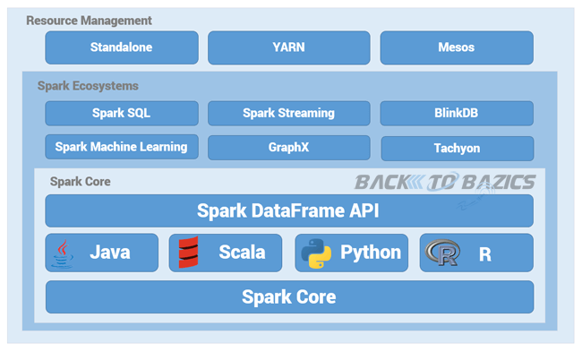

* jy3174 Jace Yang
  * wrote the entire tutorial

## Spark DataFrame

[Apache Spark](https://spark.apache.org/) is a DB engine that executes large-scale data processing jobs on both single-node machines or clusters. Originally, it was developed at the University of California, Berkeley's AMPLab.

The foundation of Spark is Spark Core, which provides distributed data execution on resilient distributed dataset (RDD) through multiple application programming interface (Java, Python, Scala, and R).

Built upon spark core, Spark is composed of the following modules. Spark SQL is an important component upon it. In this tutorial, we will focus on commands of Spark Dataframe, which is the base data format of Spark SQL!

### The Problem and Solution

* The problem that Spark solves

    > Lets zoom out and see what is spark first!

    - Decade ago, database had been quickly growing beyond the ability of a single machine to handle the ever-growing load with acceptable latency. 
    
        When the hardware upgrade on a single node (adding memory, adding disks, employing stronger CPUs) is too expensive to justify the cost, another way to satisfy this demand is to leverage multiple machines!

    - Then, Hadoop came, bringing its HDFS + YARN + MapReduce software framework:
        - `HDFS(Hadoop Distributed File System)` is for distributedly storing data, which has become the industry standard now. <mark style="background-color:#c3dbfc;">#Still in use</mark>

        - `YARN(Yet Another Resource Negotiator)` allocates computational resources to various applications. <mark style="background-color:#c3dbfc;">#Still in use</mark>

        - `MapReduce` is the programming model. It generalize a data processing module to be map function, implicitly combine and partition, and then the reduce funtion. [A good tutorial on this](https://www.talend.com/resources/what-is-mapreduce/). However, due to lack of abstraction for utilizing distributed memory this algorithm costly I/O intermediate data to a stable file system (e.g. HDFS). And the Map + Reduce framework can't describe many complex data processing process, for example join. <mark style="background-color:#c3dbfc;">#Not used ver often</mark>
 
    - Spark is to replace this Mapreduce process to make it fast!

* How does Spark DataFrame solve the problem

    Spark implement Map Reduce in Hadoop infrastructure.

    - Unlike Hadoop MapReduce, Spark used memory to hold intermediate results. It also supports more flexible language. It replace Hadoop's MapReduce but still use other modules in Hadoop infrastructures, making the HDFS + YARN + Spark combinations be “One Stack to rule them all ” big data framework

    - Spark RDD: Spark RDD is the data structure in Spark Core, which allows developers implicitly store imtermediate data set in the memory. However
    
    
    - **Spark DataFrame**: Built upon Spark Core, Spark SQL use dataframe to implement the `table` in the relational database schema, making spark easier to process the structureal or semi-structural database.

* What are the alternatives, and what are the pros and cons of Spark DataFrame compared with alternatives?  (what makes it unique?)

    |  | Spark DataFrame | Alternatives |
    | :--- | :--- | :--- |
    | Pros | 兼容：可以运行在 Hadoop Yarn, Apache Mesos, Kubernets, Spark Standalone等集群中，可以访问 HBase, HDFS, Hive, Cassandra 在内的多种数据库 | Java |
    |  | Unify: 在Spark出现之前,想要在一个组织内同时完成多种大数据分析任务,必须部署多套大数据工具,比如• 离线分析用Hadoop MapReduce   • 查询数据用Hive • 流数据处理用Storm • 机器学习用Mahout. 增加了大数据系统开发的难度 导致系统的运维变得复杂• 需要在多个系统间进行数据格式转换和传输工作,这个过程既费时又费力 | 基于磁盘 |
    | |- 在内存时的运行速度是 Hadoop MapReduce 的100倍 基于硬盘的运算速度大概是 Hadoop MapReduce 的10倍 ｜  Hadoop MapReduce|
    | |处理大规模结构化数据的时候更加容易. | Spark RDD|
    | Cons | Small Data: 缺乏有效支持随机读取小文件的能力,因此不适合小文件的存储计算快，但是启动的时候会浪费资源所以还慢，但跟pandas比，Pandas只能单核 | Pandas/R··· |
    |  | Hadoop数据并没有加密,因此如果数据需要在互联网上传输,则存在数据泄漏的风险。 | 
    |  | Very expressive, convenient to program, but no one knew how
to scale SQL execution! | SQL|
        
* How Spark DataFrame relates to topics from 4111

    - Spark DataFrame is Spthe table object in SparkSQL, which is very similar to the table we learn from this course. 二维表都是数据库的(Rows and Columns!) One more schema!

    - We can even run SQL that we learned in this course directly in Spark!

### Tutorial

#### Example

Construct and describe a compelling example for the technology that is motivated by one member's project 1 application.  The example and tutorial must be original.

In my Project 1 [yelp database/web implementation](https://github.com/Jace-Yang/yelp_db_clone), we clone a Yelp full-stack web app using the official website.

#### Tutorial

Write a short tutorial on how to use the technology to solve the example.  It may help to link to a working example (github repo or colab notebook), or a Loom tutorial video.